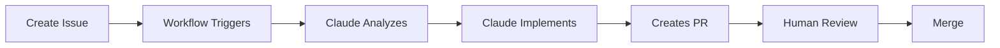

# Claude Agentic Workflow

Transform your GitHub repository into an AI-powered development environment where Claude autonomously implements solutions.

## What Is This?

This repository contains GitHub Actions workflows that enable Claude Code to:
- ✅ Automatically analyze new issues
- ✅ Implement complete solutions autonomously
- ✅ Create production-ready pull requests
- ✅ Move issues through your Kanban board
- ✅ Save 2.7+ hours per issue on average

## Quick Links

- **[Quick Start Guide](QUICK_START_GUIDE.md)** - ⭐ Get running in 15 minutes
- **[Setup Guide](AGENTIC_WORKFLOW_SETUP.md)** - Comprehensive setup documentation
- **[Implementation Report](AGENTIC_WORKFLOW_IMPLEMENTATION_REPORT.md)** - Complete technical documentation
- **[Contributing Guide](CONTRIBUTING.md)** - How to contribute and versioning system

## What You Get

After setup, every time you create an issue:

1. **Within 30 seconds**: Workflow triggers automatically
2. **Within 2-3 minutes**: Issue analyzed, labeled, and commented
3. **Within 3-5 minutes**: Code implemented and PR created
4. **You review**: Check the PR, approve/request changes, merge

## Quick Start

```bash
# 1. Generate Claude OAuth token
claude setup-token

# 2. Add secrets to your repository
gh secret set CLAUDE_CODE_OAUTH_TOKEN --repo YOUR_ORG/YOUR_REPO
gh secret set PERSONAL_ACCESS_TOKEN --repo YOUR_ORG/YOUR_REPO

# 3. Copy workflow files to your repository
mkdir -p .github/workflows
curl -o .github/workflows/issue-automation.yml \
  https://raw.githubusercontent.com/alanops/claude-agentic-workflow/main/.github/workflows/issue-automation.yml
curl -o .github/workflows/agentic-workflow.yml \
  https://raw.githubusercontent.com/alanops/claude-agentic-workflow/main/.github/workflows/agentic-workflow.yml

# 4. Customize the workflows with your organization/project details

# 5. Commit and push
git add .github/workflows/
git commit -m "Add Claude agentic workflows"
git push

# 6. Create a test issue!
gh issue create --title "Test: Add hello function" \
  --body "Create a simple hello() function"
```

See the **[Quick Start Guide](QUICK_START_GUIDE.md)** for detailed instructions.

## Features

### Two Workflows Included

**1. Issue Automation** (`issue-automation.yml`)
- Auto-labels issues based on content
- Determines priority level
- Adds analysis comments
- Optionally adds to project board

**2. Agentic Workflow** (`agentic-workflow.yml`)
- Complete autonomous development
- Code implementation from scratch
- Full test coverage
- PR creation with detailed descriptions
- Project board integration

### Security

- No API keys exposed in code
- Uses GitHub Secrets for credentials
- OAuth token-based authentication
- All code stays in your repository
- Human review required before merge

### Cost Effective

- **Typical cost**: $1-2 per issue
- **Time saved**: 2.7 hours per issue (~$400 value)
- **ROI**: 6,000%+ return on investment
- See [Implementation Report](AGENTIC_WORKFLOW_IMPLEMENTATION_REPORT.md) for detailed metrics

## Requirements

- Claude Code v1.0.44 or later
- GitHub repository (organization or personal)
- Admin access to repository settings
- GitHub CLI (`gh`) installed
- Optional: GitHub Projects v2 board

## How It Works



1. You create an issue describing what needs to be done
2. GitHub Actions triggers the Claude workflow
3. Claude analyzes your codebase and requirements
4. Claude implements the solution autonomously
5. Claude creates a PR with detailed description
6. You review and merge (or request changes)

## Customization

Both workflows are highly customizable:

- **Branch naming**: Change `branch_prefix` parameter
- **Tool access**: Add/remove allowed tools
- **Trigger conditions**: Modify when workflows run
- **Project board**: Configure your project number
- **Custom instructions**: Add repository-specific guidelines

See the [Setup Guide](AGENTIC_WORKFLOW_SETUP.md) for customization options.

## Best Practices

1. **Start small**: Begin with documentation and simple bugs
2. **Write clear issues**: Detailed requirements = better results
3. **Always review**: Never auto-merge without human review
4. **Monitor costs**: Check Claude usage regularly
5. **Provide feedback**: Comment on PRs to guide future work

## Troubleshooting

**Workflows not triggering?**
- Check `.github/workflows/` is on main branch
- Verify GitHub Actions are enabled in Settings

**Permission errors?**
- Regenerate Personal Access Token with correct scopes
- Verify secrets are set: `gh secret list --repo YOUR_REPO`

**Claude makes mistakes?**
- Improve issue description clarity
- Add custom instructions to workflow
- Update CLAUDE.md with coding standards

See [Troubleshooting](QUICK_START_GUIDE.md#troubleshooting) for more help.

## Real-World Example

From our testing:

**Issue #25**: "Create simple hello-world example"
- **Time taken**: 2 minutes 27 seconds
- **Result**: 45 lines of production-quality markdown
- **Features**: 5+ markdown features (exceeded requirements)
- **PR**: Ready for review with detailed description

See [Implementation Report](AGENTIC_WORKFLOW_IMPLEMENTATION_REPORT.md) for complete case study.

## Documentation

- **[Quick Start Guide](QUICK_START_GUIDE.md)** - 15-minute setup process
- **[Setup Guide](AGENTIC_WORKFLOW_SETUP.md)** - Comprehensive 400+ line guide
- **[Implementation Report](AGENTIC_WORKFLOW_IMPLEMENTATION_REPORT.md)** - 1,200+ line technical report

## Support

- **Issues**: Report problems in this repository
- **Claude Docs**: https://docs.claude.com/claude-code
- **GitHub Actions**: https://docs.github.com/actions

## Releases and Versioning

This repository uses automatic semantic versioning based on commit messages:

- **Automatic releases**: Every push to `main` creates a new version if changes are detected
- **Semantic versioning**: Follows [SemVer](https://semver.org/) (major.minor.patch)
- **Conventional commits**: Use [conventional commit messages](https://www.conventionalcommits.org/) for automatic versioning

### Version Bumps

- `feat:` → Minor version bump (v1.0.0 → v1.1.0)
- `fix:` → Patch version bump (v1.0.0 → v1.0.1)
- `feat!:` or `BREAKING CHANGE` → Major version bump (v1.0.0 → v2.0.0)

### Latest Release

Check the [Releases page](https://github.com/alanops/claude-agentic-workflow/releases) for the latest version and changelog.

## License

MIT License - Feel free to use and modify for your needs.

## Contributing

Contributions are welcome! This project uses:
- **Conventional Commits** for automatic versioning
- **Semantic Versioning** for releases
- **Automatic tagging** via GitHub Actions

Please read [CONTRIBUTING.md](CONTRIBUTING.md) for:
- Commit message conventions
- Development workflow
- Pull request guidelines
- Testing procedures

Quick start for contributors:
1. Fork the repository
2. Create a feature branch: `git checkout -b feat/amazing-feature`
3. Commit using conventional commits: `git commit -m "feat: add amazing feature"`
4. Push and create a pull request

## Acknowledgments

Built with:
- [Claude Code](https://claude.ai/code) by Anthropic
- [GitHub Actions](https://github.com/features/actions)
- [anthropics/claude-code-action](https://github.com/anthropics/claude-code-action)

---

**Ready to get started?** Head to the **[Quick Start Guide](QUICK_START_GUIDE.md)** and be up and running in 15 minutes! 🚀
